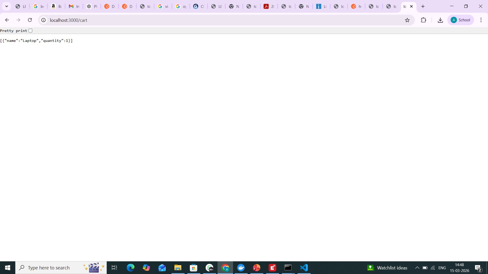

# Smart E-Commerce Checkout Workflow

## Project Overview

This project demonstrates an **end-to-end Smart E-Commerce Checkout Workflow** using REST APIs.
The system simulates a real-world checkout pipeline where different services handle inventory, cart, discount, and payment.

The workflow is executed using API calls.

### Workflow

Inventory → Cart → Discount → Payment

---

## Technologies Used

* Node.js
* Express.js
* REST APIs
* Postman / cURL
* GitHub

---

## Project Structure

```
smart-ecommerce-checkout
│
├── services
│   ├── inventory.js
│   ├── cart.js
│   ├── discount.js
│   ├── payment.js
│
├── screenshots
│   ├── inventory.png
│   ├── cart.png
│   ├── discount.png
│   ├── payment.png
│
├── server.js
├── package.json
└── README.md
```

---

## API Demonstration

### 1️⃣ Add Inventory

API Endpoint:

```
POST /inventory
```

Screenshot:


---

### 2️⃣ Add Item to Cart

API Endpoint:

```
POST /cart
```

Screenshot:



---

### 3️⃣ Apply Discount

API Endpoint:

```
POST /discount
```

Example Code:

```
NEWYEAR
```

Screenshot:


---

### 4️⃣ Process Payment

API Endpoint:

```
POST /payment
```

Screenshot:


---

## Expected Outcome

The checkout workflow successfully demonstrates the following sequence:

1. Inventory item is added.
2. Item is added to cart.
3. Discount code is applied.
4. Payment is processed successfully.

This demonstrates a simplified **microservice-style checkout pipeline similar to real-world e-commerce systems.**

---

## Author

Amruthesh S P
MCA – Smart E-Commerce Checkout Workflow Assignment
